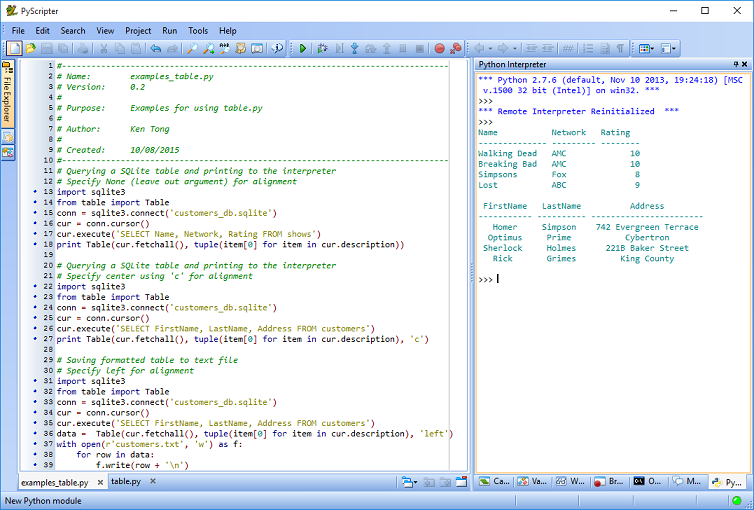

# Table

Table takes data, formats it and outputs the data in a tabular format. Each column will be sized to the longest item of that column. 

## Dependencies
Python 2.7

## Usage
### Module
You can import the table module and use the Table class.

    from table import Table
    Table(data, {header}, {alignment})

**data**: An input iterable of type list or tuple. (required)

**header**: A tuple or list specifying the headers for the data. If header is in the data iterable, 'firstrow' must be specified. {optional}

**alignment**: Alignment of the column. Specify None (default), left right or centre. You can also leave out the argument if specifying None or use the first letter (l, r, or c) to specify alignment. {optional}

## Using the Formatted Table

**Print the table to the interpreter**

`print Table(data, {header}, {alignment})`

**Iterate over the items in formatted table**

    for item in Table(data, {header}, {alignment}):
        print item
    
**Get a specific item from the formatted table**

`Table(data, {header}, {alignment})[2]`

_Note: If the created table has headers, items [0] will be the header and [1] will be the header underline._

## Examples
###Querying a SQLite table and printing to the interpreter

    import sqlite3
    from table import Table
    conn = sqlite3.connect('customers_db.sqlite')
    cur = conn.cursor()
    cur.execute('SELECT FirstName, LastName, Address FROM customers')
    print Table(cur.fetchall(), tuple(item[0] for item in cur.description), 'center')

Output

     FirstName   LastName          Address        
    ----------- ---------- -----------------------
       Homer     Simpson    742 Evergreen Terrace 
      Optimus     Prime           Cybertron       
     Sherlock     Holmes      221B Baker Street   
       Rick       Grimes         King County      

###Saving formatted table to text file

    import sqlite3
    from table import Table
    conn = sqlite3.connect('customers_db.sqlite')
    cur = conn.cursor()
    cur.execute('SELECT FirstName, LastName, Address FROM customers')
    data = Table(cur.fetchall(), tuple(item[0] for item in cur.description), 'center')
    with open(r'D:\Output\customers.txt', 'w') as f:
    for row in data:
        f.write(row + '\n')

## Screenshot
### Using table in PyScripter

